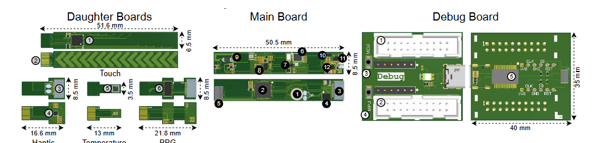

# SensWear Hardware



SensWear is a modular wearable sensing platform. This repository contains the Altium Designer source files, reusable component libraries, PCB layouts, schematics, generated documentation, and manufacturing outputs for the SensWear V1R1 hardware.

The design is split into a main board and several function-specific boards so that each part of the system can be developed, reviewed, manufactured, and tested independently. A multi-board project is also included to support system-level integration.

## Repository structure

```text
hardware-v1/
├── Assets/                       Shared project assets
├── Components/                   Reusable schematic and PCB component libraries
│   └── IBIS/                     Signal-integrity models
├── Resources/                    Supporting design resources
├── Templates/                    Altium document and project templates
├── SensWear-V1R1-Main/           Main controller/hub board
├── SensWear-V1R1-Debug/          Programming, debug, SWD, and UART-to-USB board
├── SensWear-V1R1-Haptic/         Haptic-feedback board
├── SensWear-V1R1-PPG/            Optical PPG sensing board
├── SensWear-V1R1-Temperature/    Temperature-sensing board
├── SensWear-V1R1-Touch/          Touch-sensing board
├── SensWear-V1R1-Panel/          Sensor-panel PCB and panel manufacturing project
├── SensWear_V1R1/                Altium multi-board integration project
└── SensWear_V1R1.DsnWrk          Top-level Altium design workspace
```

Most board folders follow this layout:

```text
SensWear-V1R1-<Board>/
├── *.PrjPcb                      Altium PCB project
├── Schematics/ or Schematic/     Schematic source documents
├── PCB/                          PCB layout source document
├── Output/                       Generated review and manufacturing files
│   └── Manufacturing/
│       ├── Assembly/             BOM, pick-and-place, and assembly drawings
│       └── Fabrication/          Gerber and NC drill files
├── Project Outputs for .../      Altium-generated reports and validation results
└── History/                      Local Altium document history, where present
```

The Altium source files are the authoritative design sources. Files under `Output/` and `Project Outputs for .../` are generated artifacts and may need to be regenerated after a source change.

## Board documentation and generated outputs

The following links point to the primary generated documents for each hardware section. The `Manufacturing` links provide access to the available BOMs, pick-and-place files, assembly drawings, Gerbers, drill files, and packaged fabrication outputs.

| Section | Purpose | Design documentation | Manufacturing documentation and outputs |
|---|---|---|---|
| Main board | Central hub containing the main processing, power, memory, and system interfaces | [Schematics PDF](SensWear-V1R1-Main/Output/SensWear_V1R1_Schematics.PDF) | [Manufacturing PDF](SensWear-V1R1-Main/Output/Manufacturing/Assembly/SensWear_MainBoard_Manufacturing.PDF) · [All manufacturing outputs](SensWear-V1R1-Main/Output/Manufacturing/) |
| Debug board | Programming and debugging interfaces, including SWD and UART-to-USB | [Documentation PDF](SensWear-V1R1-Debug/Output/SensWear_Debug_Documentation.PDF) · [Schematics PDF](SensWear-V1R1-Debug/Output/SensWear_Debug_Schematics.PDF) | [Manufacturing PDF](SensWear-V1R1-Debug/Output/Manufacturing/Assembly/SensWear_Debug_Manufacturing.PDF) · [All manufacturing outputs](SensWear-V1R1-Debug/Output/Manufacturing/) |
| Haptic board | Haptic-feedback circuitry | [Documentation PDF](SensWear-V1R1-Haptic/Output/SensWear_Haptic_Documentation.PDF) | No standalone manufacturing PDF is currently included · [All manufacturing outputs](SensWear-V1R1-Haptic/Output/Manufacturing/) |
| PPG board | Optical photoplethysmography sensing | [Documentation PDF](SensWear-V1R1-PPG/Output/SensWear_PPG_Documentation.PDF) | [Manufacturing PDF](SensWear-V1R1-PPG/Output/Manufacturing/Assembly/SensWear_PPG_Manufacturing.PDF) · [All manufacturing outputs](SensWear-V1R1-PPG/Output/Manufacturing/) |
| Temperature board | Temperature sensing | [Documentation PDF](SensWear-V1R1-Temperature/Output/SensWear_Temperature_Documentation.PDF) | [Manufacturing PDF](SensWear-V1R1-Temperature/Output/Manufacturing/Assembly/SensWear_Temperature_Manufacturing.PDF) · [All manufacturing outputs](SensWear-V1R1-Temperature/Output/Manufacturing/) |
| Touch board | Touch sensing and user-input interface | [Documentation PDF](SensWear-V1R1-Touch/Output/SensWear_Touch_Documentation.PDF) | [Manufacturing PDF](SensWear-V1R1-Touch/Output/Manufacturing/Assembly/Mate2D_v2_Touch_Manufacturing.PDF) · [All manufacturing outputs](SensWear-V1R1-Touch/Output/Manufacturing/) |
| Sensor panel | Sensor-panel PCB and panel-level manufacturing design | No standalone design PDF is currently included | [Manufacturing PDF](SensWear-V1R1-Panel/Output/Manufacturing/Assembly/SensWear_Panel_Manufacturing.PDF) · [All manufacturing outputs](SensWear-V1R1-Panel/Output/Manufacturing/) |

## Opening and reviewing the design

1. Install a compatible version of Altium Designer.
2. Open `SensWear_V1R1.DsnWrk` to load the top-level workspace.
3. Open the relevant board's `.PrjPcb` file to edit or compile that board independently.
4. Use the PDFs linked above for design review when Altium Designer is not available.
5. Before manufacturing, compile the project, run electrical and design-rule checks, and regenerate the relevant output jobs.

## Manufacturing notes

- Treat generated manufacturing files as revision-specific snapshots. Confirm that they match the intended source revision before placing an order.
- Review the BOM for component availability, approved substitutions, package compatibility, and supplier-specific part numbers.
- Verify board stack-up, controlled-impedance requirements, copper weight, finish, thickness, panelization, and assembly constraints with the selected manufacturer.
- Inspect Gerber and drill outputs in an independent viewer before release.
- Do not assume that the newest-looking dated archive is the approved release; use version control and release notes to identify the intended manufacturing package.

## Contributing

Contributions are welcome. Bug reports, design reviews, documentation improvements, component-library fixes, and hardware enhancements are all useful.

For design changes:

1. Create a focused branch for the change.
2. Update the Altium source documents rather than editing generated outputs alone.
3. Compile the affected project and run the appropriate ERC and DRC checks.
4. Regenerate documentation and manufacturing outputs affected by the change.
5. Clearly describe the motivation, affected boards, validation performed, and any manufacturing or firmware implications in the pull request.

Keep unrelated generated files, local history, editor state, and temporary files out of commits whenever possible.

## License

This project is licensed under the MIT License. You may use, copy, modify, merge, publish, distribute, sublicense, and sell copies of the project, including for commercial purposes, provided that the original copyright notice and MIT permission notice are included with copies or substantial portions of the project.

The software and design files are provided without warranty. Users are responsible for independently validating electrical safety, regulatory compliance, manufacturability, and fitness for their intended application.
